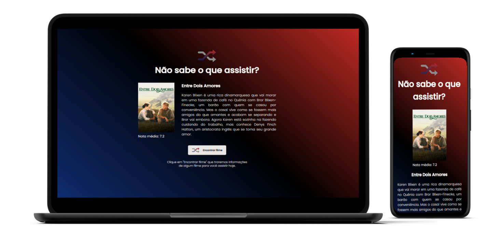
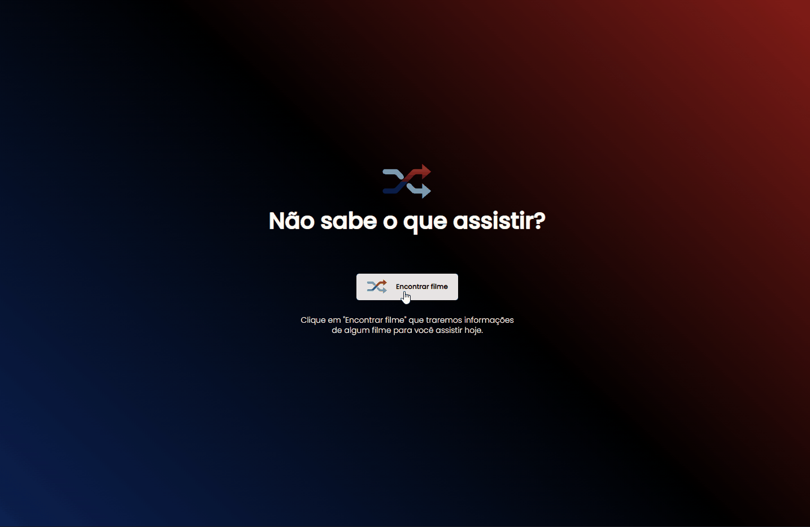

<h1 align="center">
  Rocketflix
</h1>

Acesse em: https://rocketflix.netlify.app/

## 💻 Projeto

O Rocketflix é um projeto desenvolvido por mim baseado em um desafio da escola Rocketseat. É uma página em que exibe um filme aleatoriamente para o usuário toda vez 
em que ele aperta o botão "Encontrar um filme". Para isso foi usada a blioteca Axios para acessar a API da The Movie DB, através dessa API conseguimos obter
informações sobre diversos filmes. 

<h2>Desktop & Mobile</h2>

  

<h2>App interaction</h2>

  

## 🚀 Tecnologias

Esse projeto foi desenvolvido com as seguintes tecnologias:

- HTML
- CSS
- JavaScript

API
- [The Movie DB](https://www.themoviedb.org/)

Bibliotecas

- [Google Fonts](https://fonts.google.com/)
- [Axios](https://axios-http.com/)
